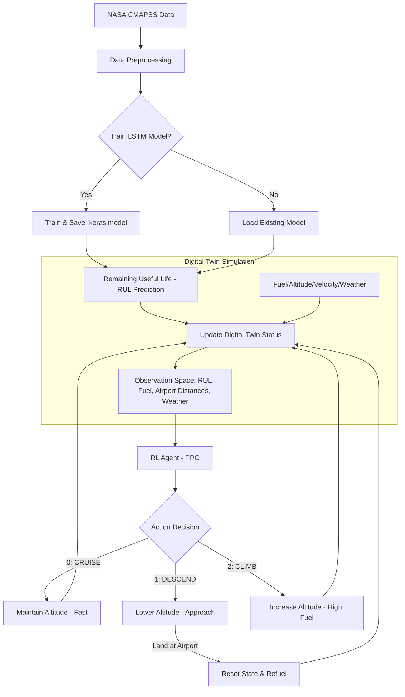

[🏠 Home](./README.md) | [📜 History](./docs/history.md) | [🌦️ Weather Plan](./docs/plan_weather.md) | [📈 RL Eval Plan](./docs/RL_EVAL_IMPROVEMENT_PLAN.md) | [🛫 MARL Proposal](./docs/MARL_FleetManagement_Proposal.md)

# ✈️ Aircraft Digital Twin - Predictive Maintenance (PPO & LSTM)

Dự án này triển khai một hệ thống **Bản sao số (Digital Twin)** cho động cơ máy bay, kết hợp giữa mô hình học sâu (Deep Learning) để dự báo sức khỏe động cơ và học tăng cường (Reinforcement Learning) để đưa ra các quyết định vận hành tối ưu.

## 🌟 Tổng quan dự án

Hệ thống cung cấp một giải pháp bảo trì dự báo (Predictive Maintenance) thông minh, giúp trả lời câu hỏi: _"Máy bay có nên tiếp tục hành trình bay tiếp theo hay cần hạ cánh để bảo trì ngay lập tức?"_

- **Dataset**: Sử dụng tập dữ liệu CMAPSS (NASA) về sự suy giảm hiệu suất động cơ phản lực.
- **AI Core**: Sử dụng **LSTM** để dự báo thời gian còn lại đến khi hỏng (RUL - Remaining Useful Life).
- **Decision Engine**: Sử dụng thuật toán **PPO (Proximal Policy Optimization)** để học chiến lược bay an toàn và tiết kiệm chi phí nhất.
- **Weather System**: Sinh các vùng thời tiết tĩnh theo từng episode, ảnh hưởng tới nhiên liệu, tốc độ, RUL hiệu dụng và hiển thị trực quan trong mô phỏng 2D.

---

## ⚙️ Kiến trúc hệ thống

Dự án được cấu trúc thành các thành phần chính sau:

1.  **Data Processing (`scripts/data/data_processor.py`)**: Làm sạch, chuẩn hóa dữ liệu cảm biến và tạo chuỗi thời gian cho mô hình AI.
2.  **LSTM Model (`scripts/models/lstm_model.py`)**: Mô hình mạng nơ-ron hồi quy (RNN) chịu trách nhiệm dự đoán các giá trị RUL từ dữ liệu cảm biến thô.
3.  **Digital Twin (`scripts/core/digital_twin.py`)**: Bản sao số mô phỏng thực tế tình trạng máy bay (nhiên liệu, độ cao, vận tốc) đồng bộ với trạng thái sức khỏe từ mô hình AI.
4.  **RL Environment (`scripts/core/aircraft_env.py`)**: Môi trường giả lập tích hợp Digital Twin, weather zones và 3 hành động điều khiển: `CRUISE`, `DESCEND`, `CLIMB`.
5.  **PPO Agent (`scripts/training/train_ppo.py`)**: Agent học cách tối đa hóa quãng đường bay trong khi vẫn đảm bảo an toàn động cơ, nhiên liệu và quyết định bảo trì hợp lý.

---

## 🌊 Luồng hoạt động (System Flow)

Hệ thống quản lý hành trình bay thông qua 3 hành động điều khiển độ cao và tốc độ:



### Chi tiết các bước:

1.  **Nạp & Xử lý dữ liệu**: Dữ liệu từ 21 cảm biến được chuẩn hóa về khoảng `[0, 1]`. Chúng tôi tạo các window 50 chu kỳ để nắm bắt xu hướng suy giảm của động cơ.
2.  **Dự báo RUL**: Mô hình LSTM nhận đầu vào là chuỗi cảm biến hiện tại và trả về con số dự báo động cơ còn bao nhiêu chu kỳ nữa sẽ hỏng.
3.  **Cập nhật Bản sao số**: Bản sao số nhận giá trị RUL này để chuyển đổi sang các cấp độ: `HEALTHY`, `WARNING`, hoặc `CRITICAL`.
4.  **Học tăng cường (RL)**: Agent quan sát trạng thái gồm RUL hiệu dụng, nhiên liệu, độ cao, khoảng cách tới 6 sân bay phụ, khoảng cách tới đích và tín hiệu thời tiết để chọn hành động:
    - **0: CRUISE**: Giữ độ cao, tiếp tục bay bằng.
    - **1: DESCEND**: Hạ độ cao để tiếp cận sân bay phụ hoặc điểm đích. Máy bay chỉ có thể hạ cánh khi `Altitude = 0` tại sân bay.
    - **2: CLIMB**: Leo cao. Hành động này tiêu thụ nhiều nhiên liệu hơn nhưng có thể dùng để né vùng thời tiết xấu hoặc tối ưu hành trình.
5.  **Tối ưu hóa**: Agent được thưởng cho tiến độ bay, hạ cánh/bảo trì hợp lý và tới đích an toàn. Phạt nặng nếu hết xăng, hỏng động cơ, hoặc hạ cánh ngoài sân bay.

---

## 🚀 Hướng dẫn khởi chạy

### 1. Cài đặt môi trường

Yêu cầu Python 3.10+ và các thư viện cần thiết:

```bash
pip install -r requirements.txt
```

_(Nếu chưa có file requirements.txt, hãy cài đặt: tensorflow, stable-baselines3, shimmy, gym, pandas, scikit-learn)_

### 2. Chạy Demo

Khởi chạy file chính để xem demo text-based với weather-aware environment:

```bash
python main.py
```

Chạy mô phỏng 2D có weather bands, visual drift và turbulence shake:

```bash
python -m scripts.demos.sim_2d
```

### 3. Huấn luyện Agent (PPO)

Để hệ thống tự học cách bay tối ưu:

```bash
python -m scripts.training.train_ppo
```

---

## 📚 Tài liệu bổ sung

Các tài liệu thiết kế, lịch sử thay đổi và proposal đã được gom vào thư mục `docs/`:

- [Project History](./docs/history.md)
- [Weather Implementation Plan](./docs/plan_weather.md)
- [RL Evaluation Improvement Plan](./docs/RL_EVAL_IMPROVEMENT_PLAN.md)
- [MARL Fleet Management Proposal](./docs/MARL_FleetManagement_Proposal.md)

---

## 📊 Kết quả mong đợi

- **RUL Prediction**: Sai số thấp hơn mô hình Random Forest thông thường.
- **Flight Strategy**: Agent biết hạ cánh đúng lúc khi RUL thấp (CRITICAL) nhưng không quá sớm để lãng phí nhiên liệu và chi phí vận hành.

---

_Ghi chú: Bản thiết kế hạ tầng (Terraform) hiện đang được ẩn đi để tập trung vào logic lõi của Digital Twin._
