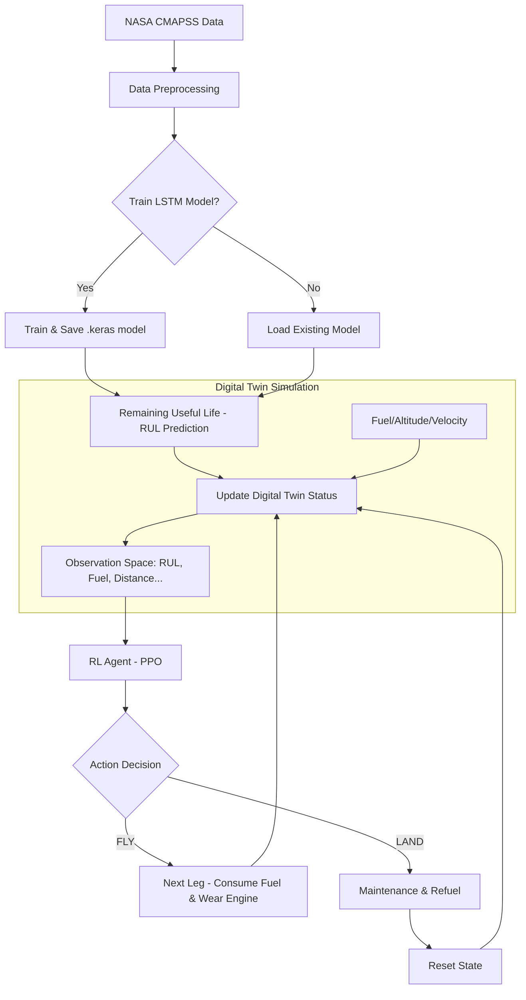

# ✈️ Aircraft Digital Twin - Predictive Maintenance (PPO & LSTM)

Dự án này triển khai một hệ thống **Bản sao số (Digital Twin)** cho động cơ máy bay, kết hợp giữa mô hình học sâu (Deep Learning) để dự báo sức khỏe động cơ và học tăng cường (Reinforcement Learning) để đưa ra các quyết định vận hành tối ưu.

## 🌟 Tổng quan dự án

Hệ thống cung cấp một giải pháp bảo trì dự báo (Predictive Maintenance) thông minh, giúp trả lời câu hỏi: *"Máy bay có nên tiếp tục hành trình bay tiếp theo hay cần hạ cánh để bảo trì ngay lập tức?"*

- **Dataset**: Sử dụng tập dữ liệu CMAPSS (NASA) về sự suy giảm hiệu suất động cơ phản lực.
- **AI Core**: Sử dụng **LSTM** để dự báo thời gian còn lại đến khi hỏng (RUL - Remaining Useful Life).
- **Decision Engine**: Sử dụng thuật toán **PPO (Proximal Policy Optimization)** để học chiến lược bay an toàn và tiết kiệm chi phí nhất.

---

## ⚙️ Kiến trúc hệ thống

Dự án được cấu trúc thành các thành phần chính sau:

1.  **Data Processing (`scripts/data_processor.py`)**: Làm sạch, chuẩn hóa dữ liệu cảm biến và tạo chuỗi thời gian cho mô hình AI.
2.  **LSTM Model (`scripts/lstm_model.py`)**: Mô hình mạng nơ-ron hồi quy (RNN) chịu trách nhiệm dự đoán các giá trị RUL từ dữ liệu cảm biến thô.
3.  **Digital Twin (`scripts/digital_twin.py`)**: Bản sao số mô phỏng thực tế tình trạng máy bay (nhiên liệu, độ cao, vận tốc) đồng bộ với trạng thái sức khỏe từ mô hình AI.
4.  **RL Environment (`scripts/aircraft_env.py`)**: Môi trường giả lập tích hợp Digital Twin, nơi Agent thực hiện các hành động `FLY` hoặc `LAND`.
5.  **PPO Agent (`scripts/train_ppo.py`)**: Agent học cách tối đa hóa quãng đường bay trong khi vẫn đảm bảo an toàn tuyệt đối cho động cơ.

---

## 🌊 Luồng hoạt động (System Flow)

Dưới đây là sơ đồ luồng hoạt động của toàn bộ hệ thống từ lúc nạp dữ liệu đến khi ra quyết định:



### Chi tiết các bước:
1.  **Nạp & Xử lý dữ liệu**: Dữ liệu từ 21 cảm biến được chuẩn hóa về khoảng `[0, 1]`. Chúng tôi tạo các window 50 chu kỳ để nắm bắt xu hướng suy giảm của động cơ.
2.  **Dự báo RUL**: Mô hình LSTM nhận đầu vào là chuỗi cảm biến hiện tại và trả về con số dự báo động cơ còn bao nhiêu chu kỳ nữa sẽ hỏng.
3.  **Cập nhật Bản sao số**: Bản sao số nhận giá trị RUL này để chuyển đổi sang các cấp độ: `HEALTHY`, `WARNING`, hoặc `CRITICAL`.
4.  **Học tăng cường (RL)**: Agent quan sát trạng thái (RUL hiện tại, lượng xăng còn lại, khoảng cách tới đích) để chọn hành động:
    - **FLY**: Tiếp tục chặng bay. Nếu RUL chạm 0 khi đang bay -> **FAILURE** (Thất bại).
    - **LAND**: Hạ cánh để bảo trì. Động cơ sẽ được thay mới và nạp đầy xăng -> **SUCCESSFUL MAINTENANCE**.
5.  **Tối ưu hóa**: Agent được thưởng cho mỗi km bay xa hơn và bị phạt rất nặng nếu để xảy ra sự cố hỏng hóc giữa không trung.

---

## 🚀 Hướng dẫn khởi chạy

### 1. Cài đặt môi trường
Yêu cầu Python 3.10+ và các thư viện cần thiết:
```bash
pip install -r requirements.txt
```
*(Nếu chưa có file requirements.txt, hãy cài đặt: tensorflow, stable-baselines3, shimmy, gym, pandas, scikit-learn)*

### 2. Chạy Demo
Khởi chạy file chính để xem mô phỏng hệ thống với các hành động ngẫu nhiên hoặc huấn luyện mô hình:
```bash
python main.py
```

### 3. Huấn luyện Agent (PPO)
Để hệ thống tự học cách bay tối ưu:
```bash
python scripts/train_ppo.py
```

---

## 📊 Kết quả mong đợi
- **RUL Prediction**: Sai số thấp hơn mô hình Random Forest thông thường.
- **Flight Strategy**: Agent biết hạ cánh đúng lúc khi RUL thấp (CRITICAL) nhưng không quá sớm để lãng phí nhiên liệu và chi phí vận hành.

---
*Ghi chú: Bản thiết kế hạ tầng (Terraform) hiện đang được ẩn đi để tập trung vào logic lõi của Digital Twin.*
